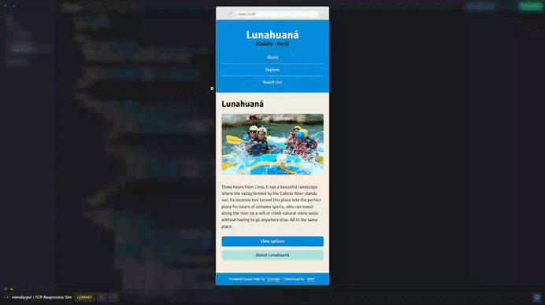

# Lunahuaná Responsive Site

## *Overview* 🌟

This project is part of the Responsive Design module in the [**Frontend Career Path**](https://v2.scrimba.com/the-frontend-developer-career-path-c0j) course by [**Scrimba**](https://v2.scrimba.com/home). It explores creating a flexible design that adapts well across different devices.

## *Screenshot* 📷

## *Links* 🔗

[Scrim code](https://v2.scrimba.com/s0drdkhc3a) 👈

[Live site](https://mendezpvi.github.io/fcp-responsive-site/) 👈

[Scrimba projects repository](https://github.com/mendezpvi/fcp-scrimba) 👈

## *What I learned* 🤓

🔳 Planning design to adapt to various screen sizes.

🔳 Using percentages, em, and rem for flexible sizing.

🔳 Implementing media queries with a mobile-first approach.

🔳 Mastering Flexbox properties like flex-wrap, gap, flex-basis, flex-grow, and flex to structure content responsively.

## *Resources* 🗃️

🗃️ [Frontend Career Path](https://v2.scrimba.com/the-frontend-developer-career-path-c0j) by Scrimba

🗃️ [Guide to Flexbox](https://css-tricks.com/snippets/css/a-guide-to-flexbox/) by CSS-Tricks

## *Author* 🔰

✨ X (formerly Twitter) - [@medezpvi](https://x.com/mendezpvi)